# Amazon EC2 Project

**Date:** May 2025  

---

## 📌 Introduction
In this project, I worked with **Amazon Elastic Compute Cloud (EC2)** to learn how to launch, monitor, secure, and resize an instance.  
The lab demonstrates how to configure a web server, update security groups, explore EC2 limits, and apply protection features such as termination protection and stop protection.  

---

## 🎯 Objectives
- Launch a web server with **termination protection** enabled.  
- Monitor EC2 instance health and system logs.  
- Modify the security group to allow HTTP access.  
- Resize the instance type and Elastic Block Store (EBS) volume.  
- Explore EC2 limits using Service Quotas.  
- Test stop protection functionality.  
- Stop the EC2 instance safely.  

📷 *EC2 Overview:*  
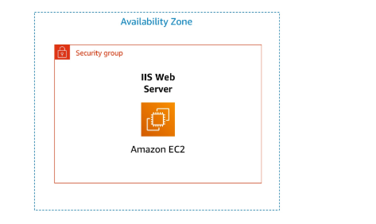

---

## ☁️ AWS Services Used
- **Amazon EC2**  
- **Amazon CloudWatch**  
- **Amazon EBS (Elastic Block Store)**  
- **Security Groups**  
- **Service Quotas**  

---

## 🛠️ Project Execution

### **Task 1: Launch EC2 Instance**
- Named the instance **Web Server**.  
- Selected **Amazon Linux 2023 AMI** with type `t2.micro`.  
- Used **vockey** key pair.  
- Configured **Lab VPC** and created a new Security Group (no rules initially).  
- Enabled **Termination Protection**.  
- Added **User Data** script to install Apache web server and create a sample HTML page.  

📷 *Launch Instance Summery:*  
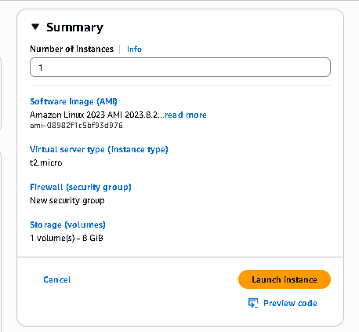

📷 *Instance Running:*  
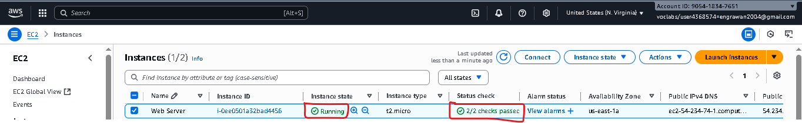

---

### **Task 2: Monitor Instance**
- Checked **Status Checks tab** → both passed.  
- Viewed **Monitoring tab** (CloudWatch metrics).  
- Opened **System Log** to verify Apache installation.  
- Captured **Instance Screenshot** for troubleshooting view.  

📷 *Status Checks:*  
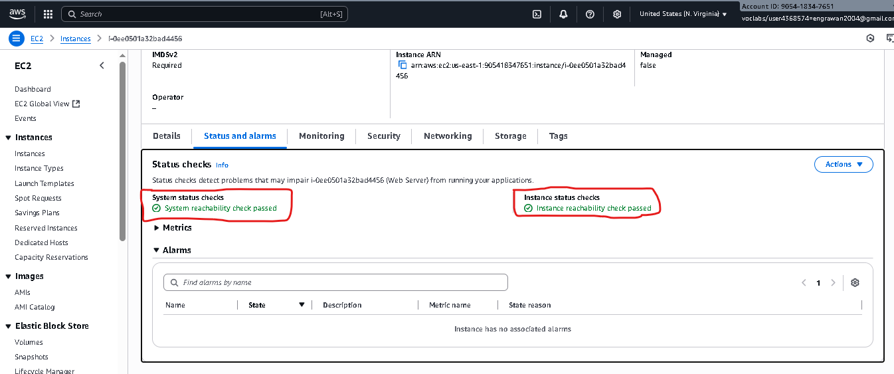

📷 *Monitoring Metrics:*  
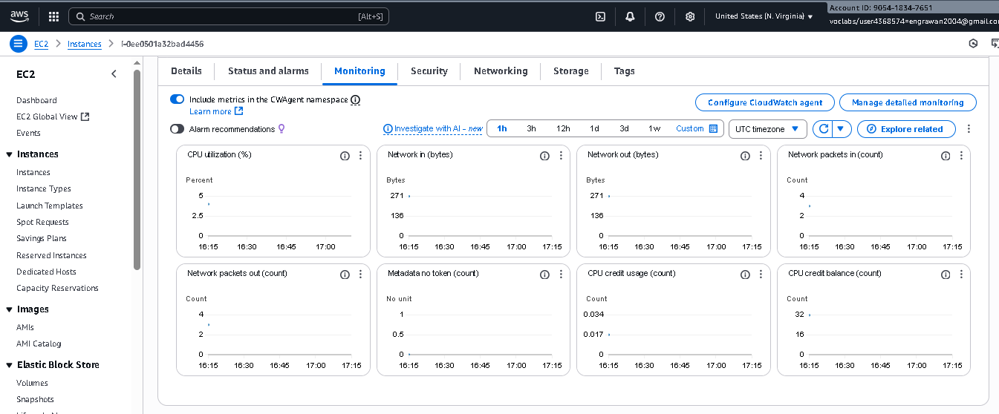

📷 *System Log:*  
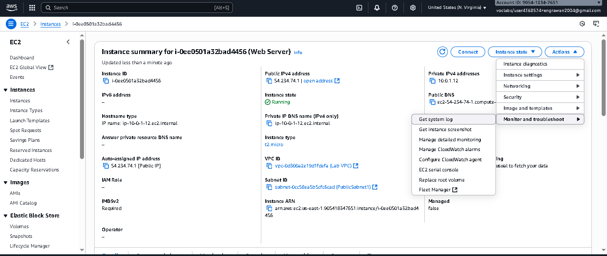

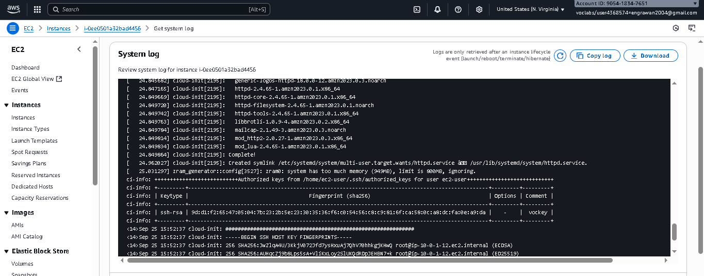

📷 *Instance Screenshot:*  
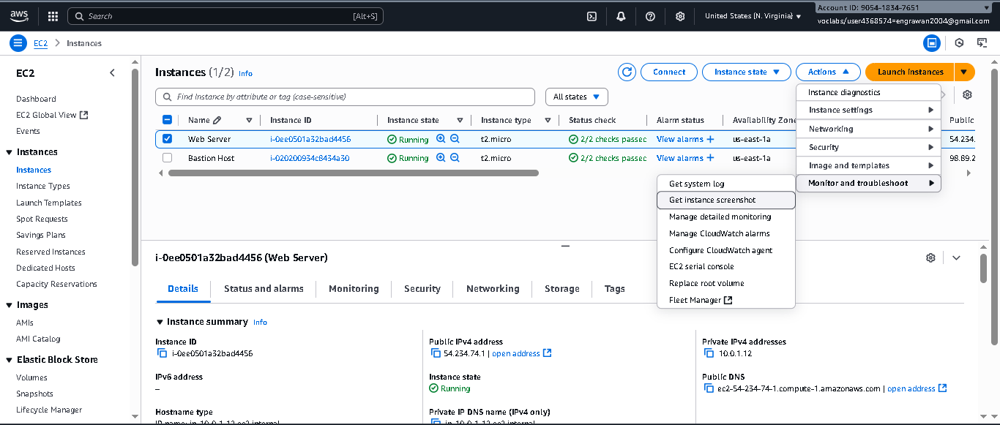

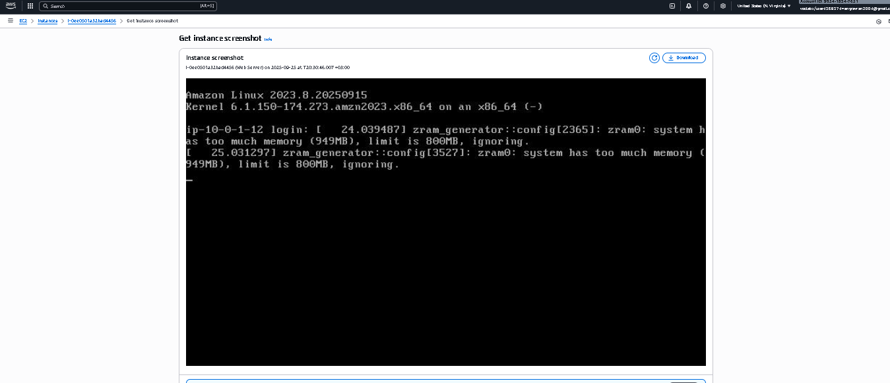

---

### **Task 3: Update Security Group & Access Web Server**
- Modified **Web Server security group** inbound rules:  
  - Allowed **HTTP (port 80)** from Anywhere-IPv4.  
- Accessed web page → message displayed:  
  **“Hello From Your Web Server!”**  

📷 *Web Server Test Before Update Security Group:*  
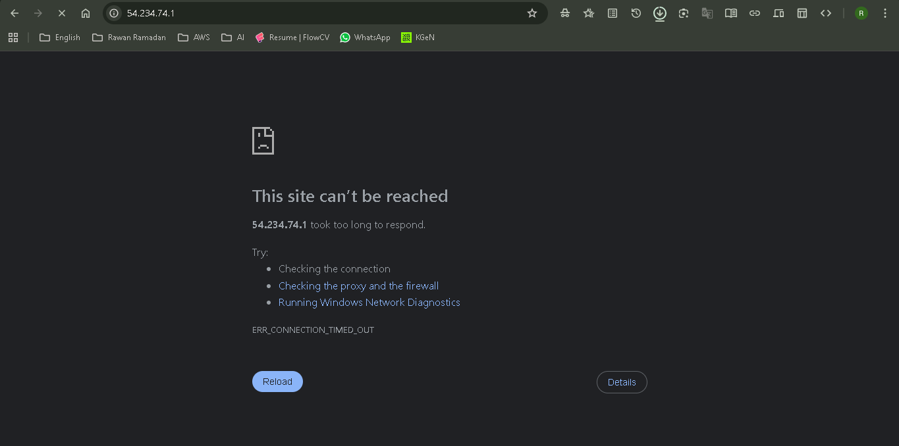

📷 *Security Group Details:*  

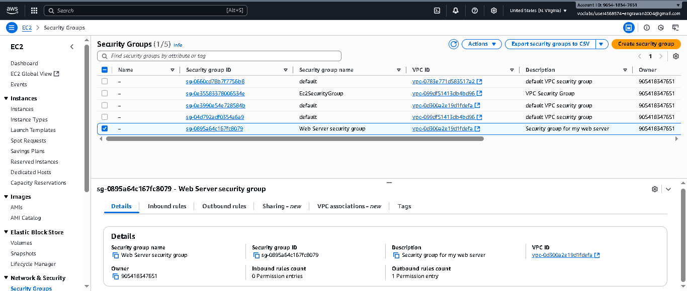

*Update Security Group:* 

   📷 *Adding Rule:*
	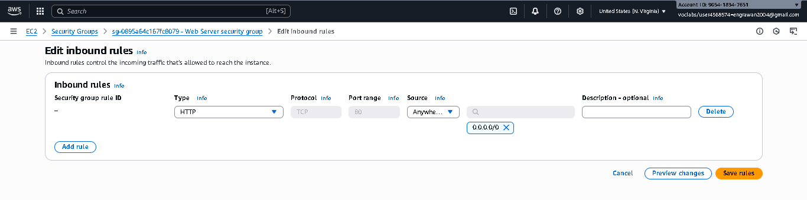
   📷 *After Update:*
	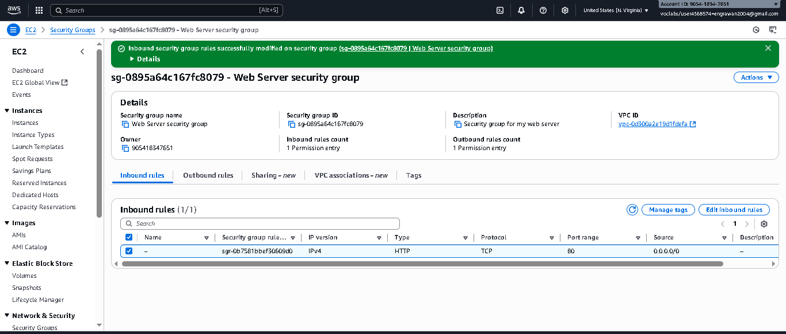

📷 *Web Server Test:* 
      --*Message Displayed Successfully*--

      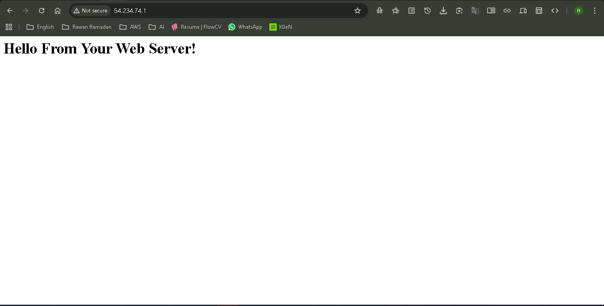

---

### **Task 4: Resize Instance**
- Stopped the EC2 instance.  
- Changed type from **t2.micro → t2.small**.  
- Enabled **Stop Protection**.  
- Resized EBS volume from **8 GiB → 10 GiB**.  
- Restarted the instance with new resources.  

📷 *Stop Instance:*  
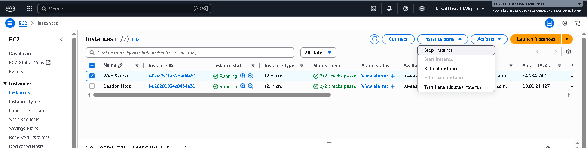
📷 *Stoped Check:*  
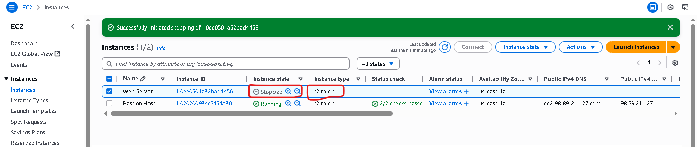

📷 *Change Instance Type:*  
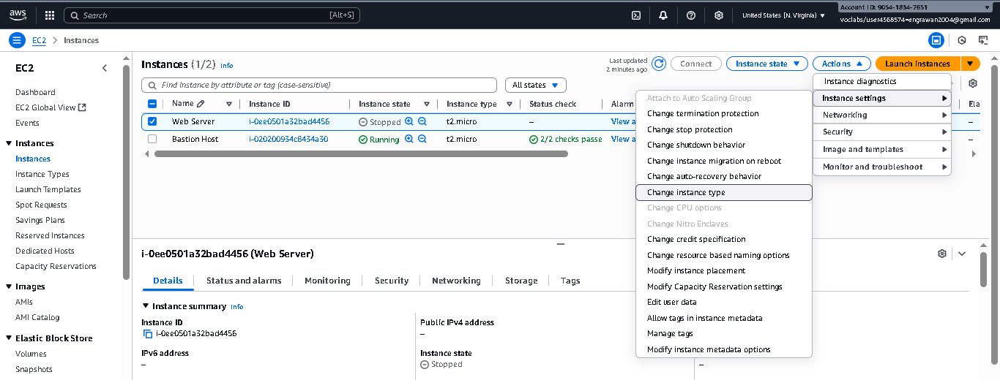

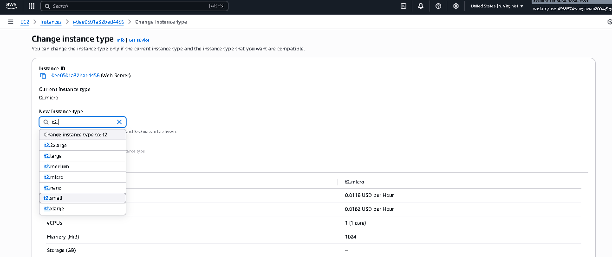

> **Note:**  
> *When you stop an instance, the instance shuts down.  
> When you later start the instance, it is typically migrated to a new underlying host computer and assigned a new public IPv4 address.  
> An instance retains its assigned private IPv4 address.  
> When you stop an instance, it is not deleted. Any EBS volumes and the data on those volumes are retained.*

📷 *Screenshot – Change stop protection:*  
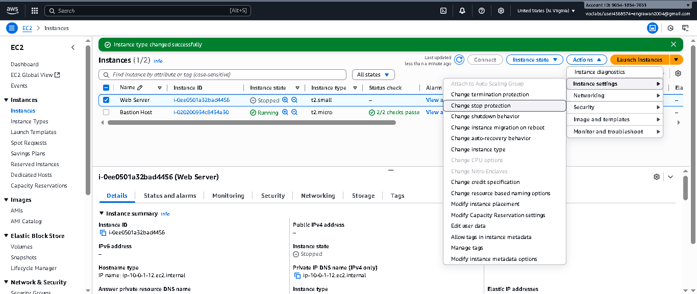  

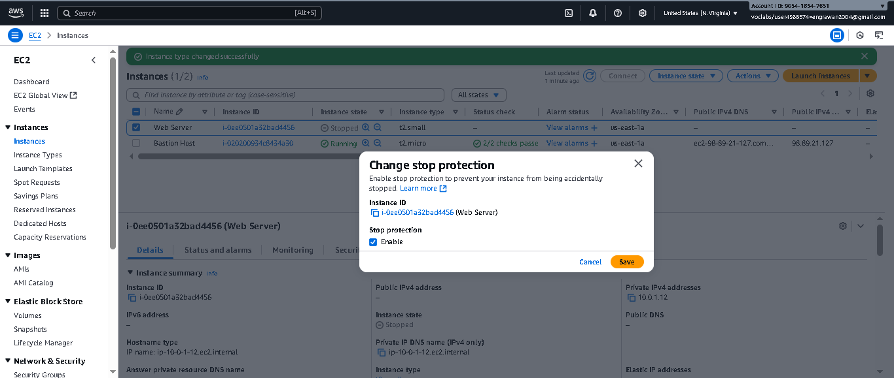  

📷 *EBS Volume Before Change:*  

📷 *Resize EBS Volume:*  
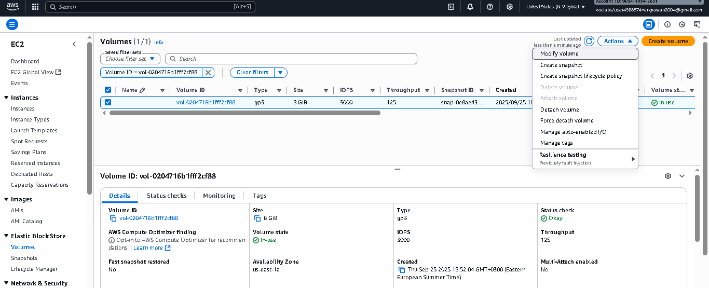

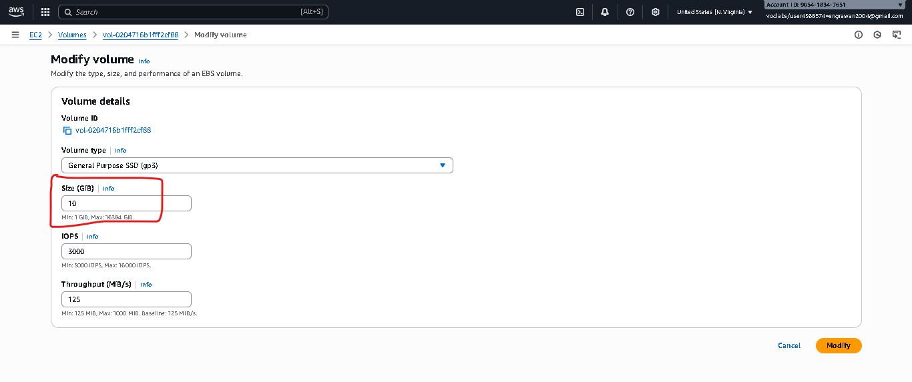

📷 *EBS Volume After Change:*  
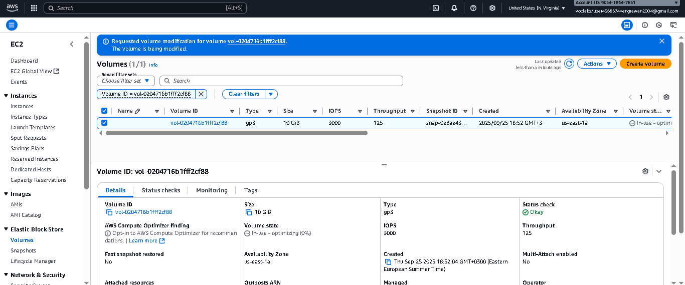

📷 *Instance Restarted:*  
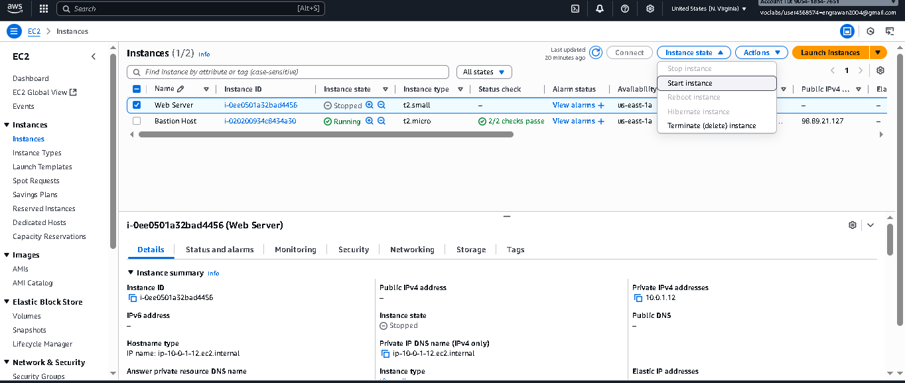

📷 *Instance Check:*  
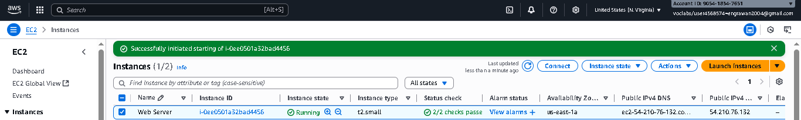

---

### **Task 5: Explore EC2 Limits**
- Opened **Service Quotas**.  
- Checked limits for **Running On-Demand Standard Instances**.  
- Observed default quota values per region.  

> 📝 **Note:**  
When searching for **running on-demand** instances in Service Quotas, multiple categories appeared (e.g., Standard, DL, F, HPC, Tn, etc.).  
Each category has a default quota value, such as **256 for Standard instances** or **96 for DL instances**.  
These quotas define the maximum number of On-Demand EC2 instances you can run per region.  
If higher capacity is required, you can submit a **quota increase request** through the AWS console.

📷 *Service Quotas:*  
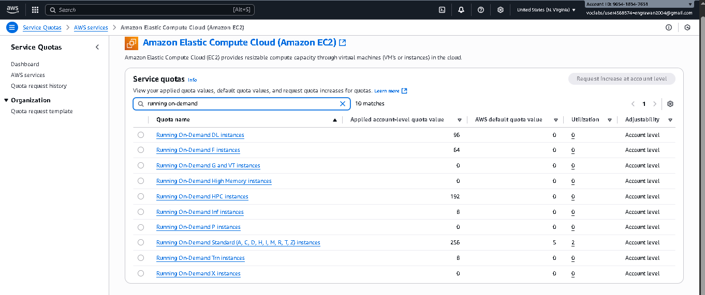

---

### **Task 6: Test Stop Protection**
- Attempted to stop instance → error displayed (Stop Protection enabled).  
- Disabled Stop Protection.  
- Stopped the instance successfully.  

> ⚠️ **Note:**  
If you see the error message:  
`Failed to stop the instance i-1234567xxx. The instance may not be stopped. Modify its 'disableApiStop' instance attribute and try again.`  
This is expected because **Stop Protection** was enabled earlier.  
It acts as a safeguard to prevent the instance from being stopped accidentally.  
To stop the instance, you must first disable Stop Protection.

📷 *Stop Protection Error:*  
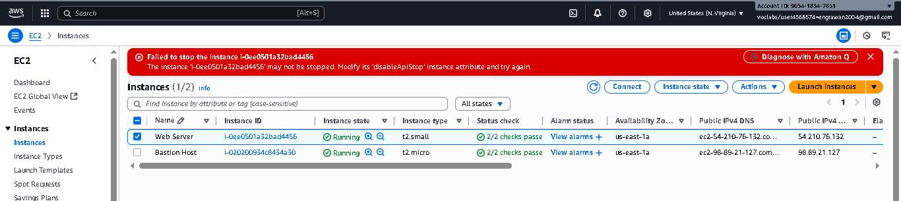

📷 *Disable Stop Protection:*  
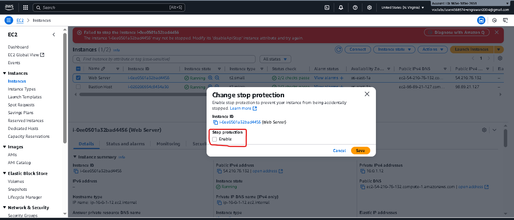

📷 *Instance Stopped:*  
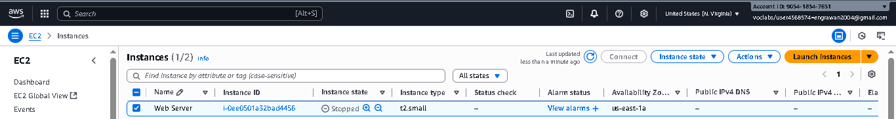

---

## 👩‍💻 Author
*Developed and documented by [Rawan Ramadan]*  
